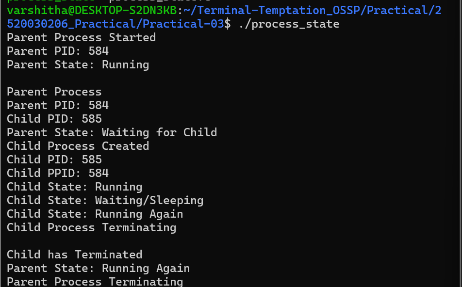
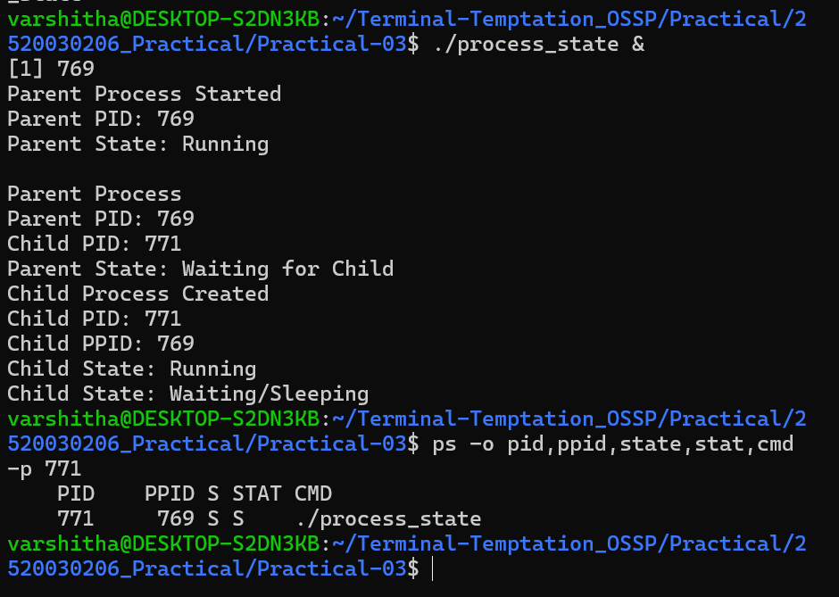
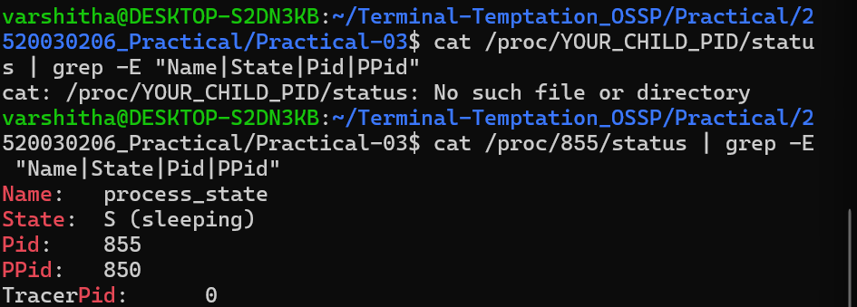
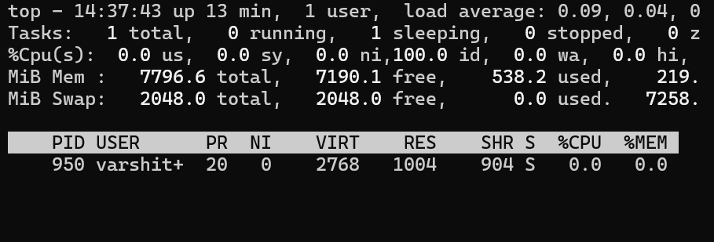
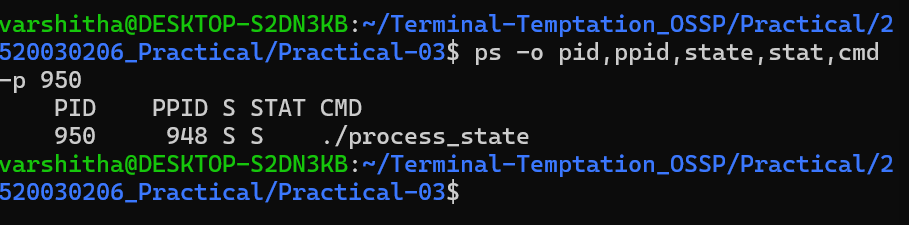

# Practical 3 - Process Creation and State Transitions

## 1. C Program Execution

## 2. Process State using ps

## 3. Process Information using /proc

## 4. Process Monitoring using top

## 5. Process Termination

