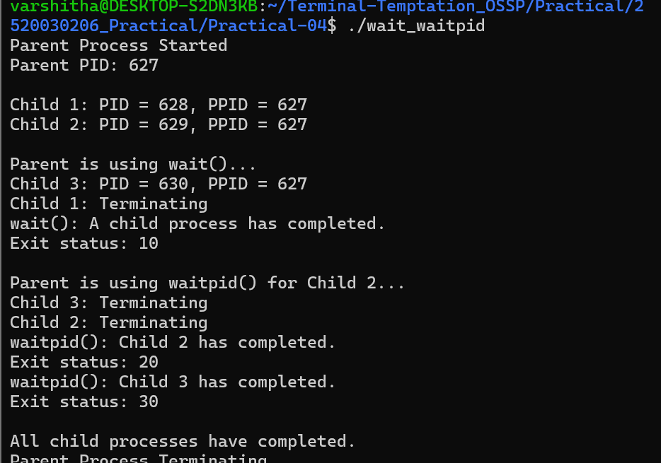
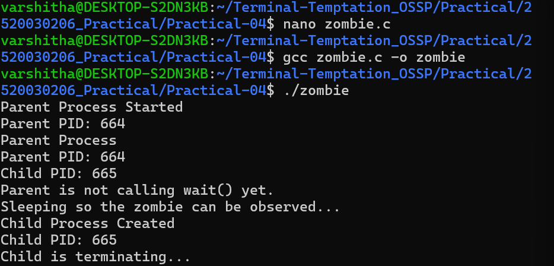
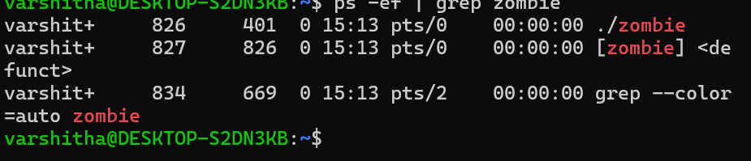
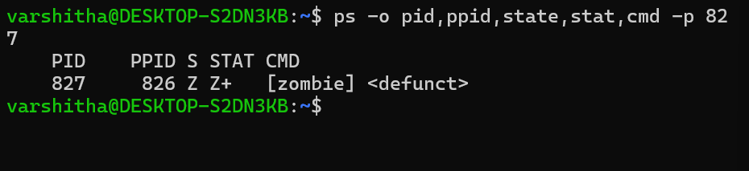
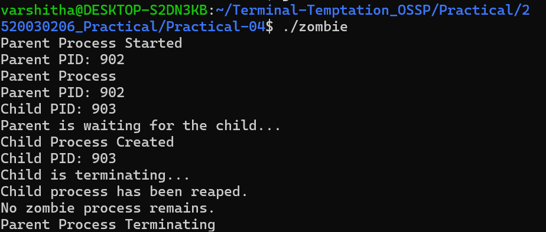

# Practical 4 - Process Synchronization and Zombie Processes

## 1. wait() and waitpid() Execution

## 2. Zombie Process using ps

## 3. Zombie Process State

## 4. Eliminating Zombie using wait()

## 5. Verification of No Zombie Process

