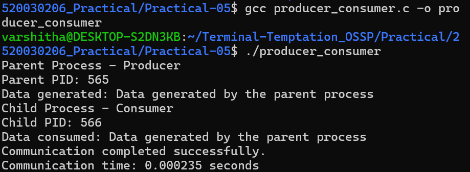
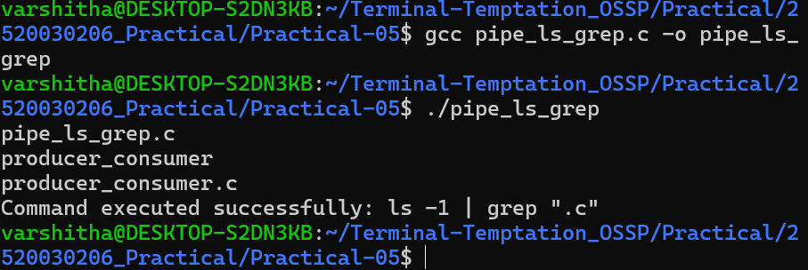
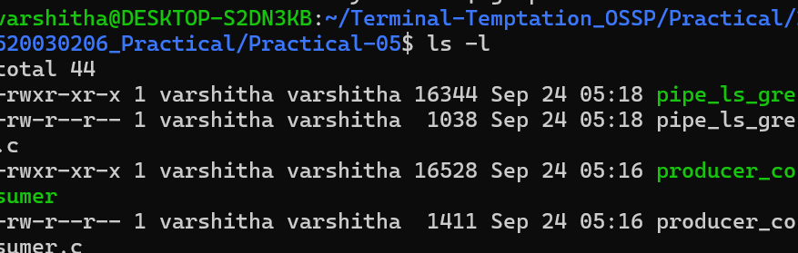
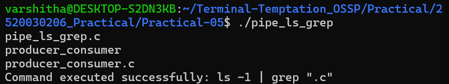

# Practical 5 - Inter-Process Communication using Pipes

## 1. Producer-Consumer Communication

## 2. Shell Pipeline using fork(), pipe(), dup2(), and exec()

## 3. Source Files and Compilation

## 4. Pipeline Verification

