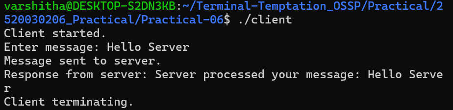
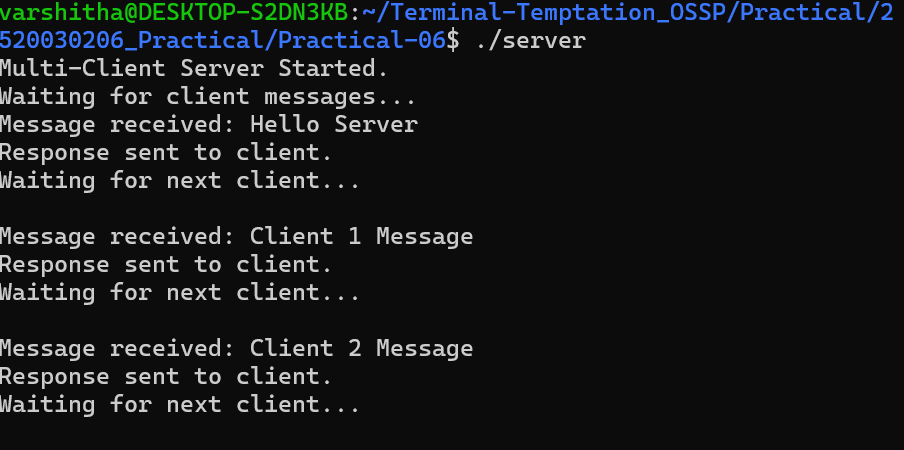
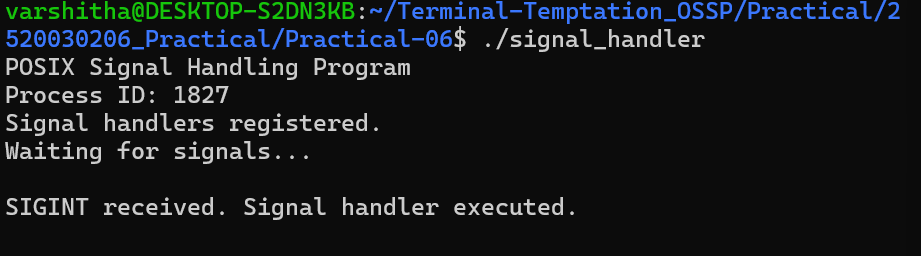
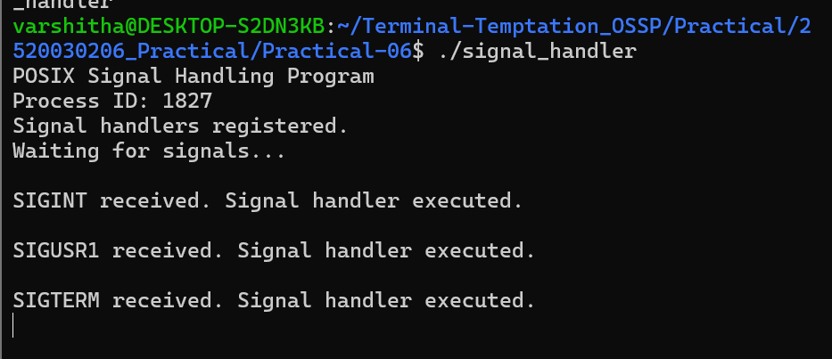

# Practical 6 - FIFO Client-Server Communication and POSIX Signal Handling

## Part A - FIFO Client-Server Communication

### 1. Client - Server Response

### 2. Server - Basic Communication

### 3. Multiple Client Communication

---

## Part B - POSIX Signal Handling

### 4. POSIX Signal Handling

