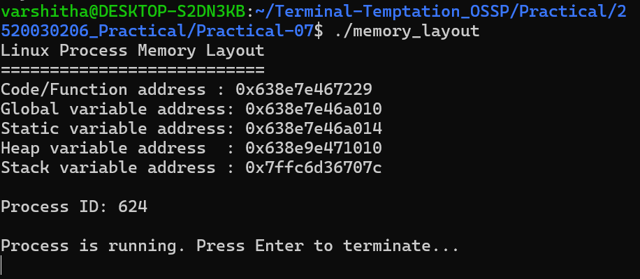
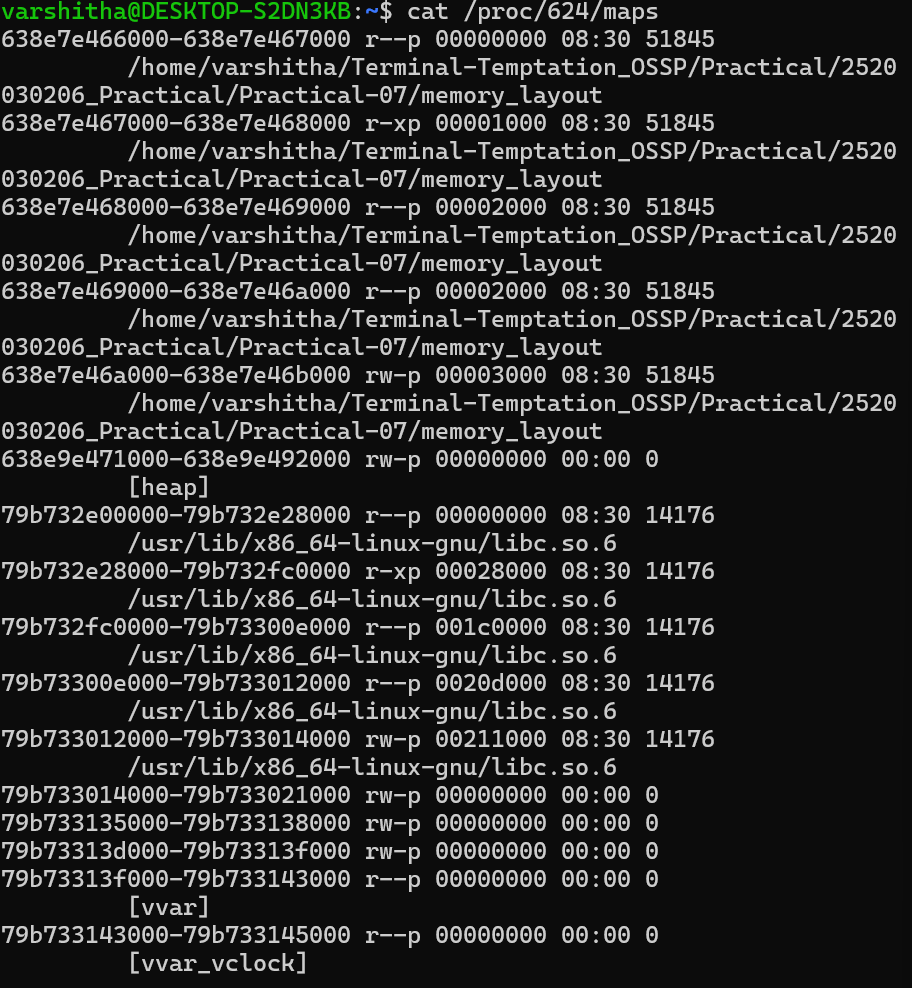
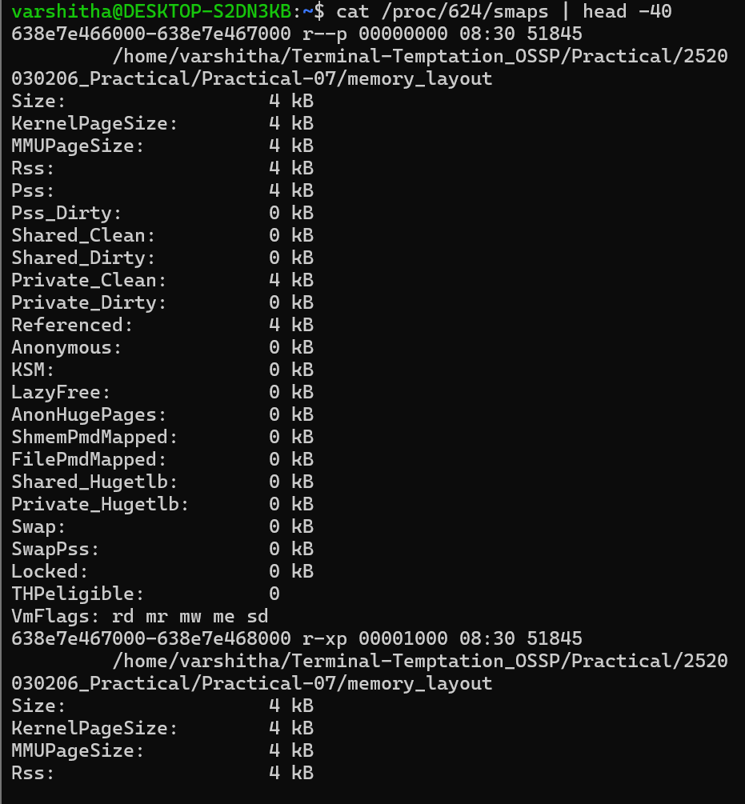
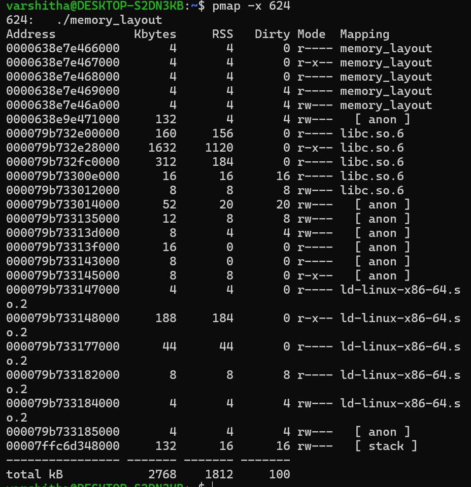

# Practical 7 - Linux Process Address Space and Virtual Memory

## 1. Variable Memory Addresses

## 2. Process Memory Mappings using /proc/<PID>/maps

## 3. Detailed Memory Information using /proc/<PID>/smaps

## 4. Memory Analysis using pmap

