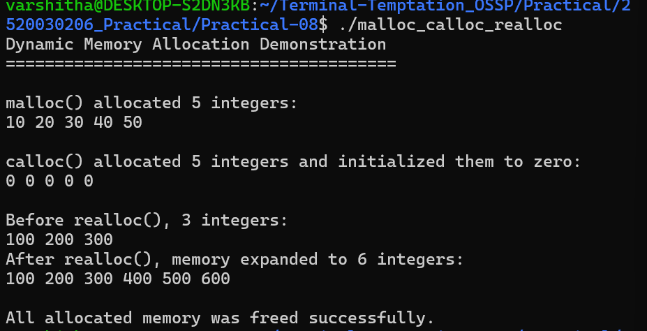
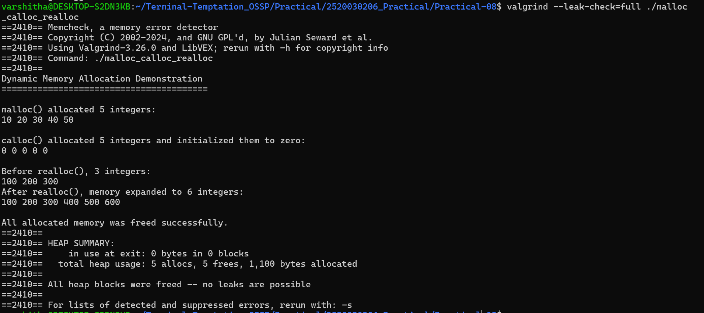
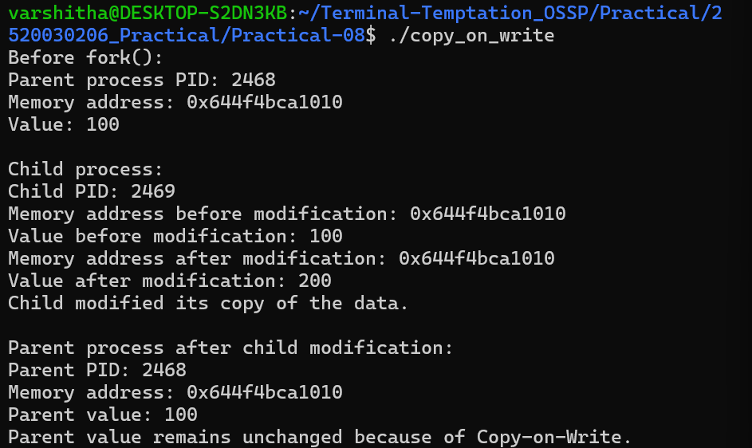
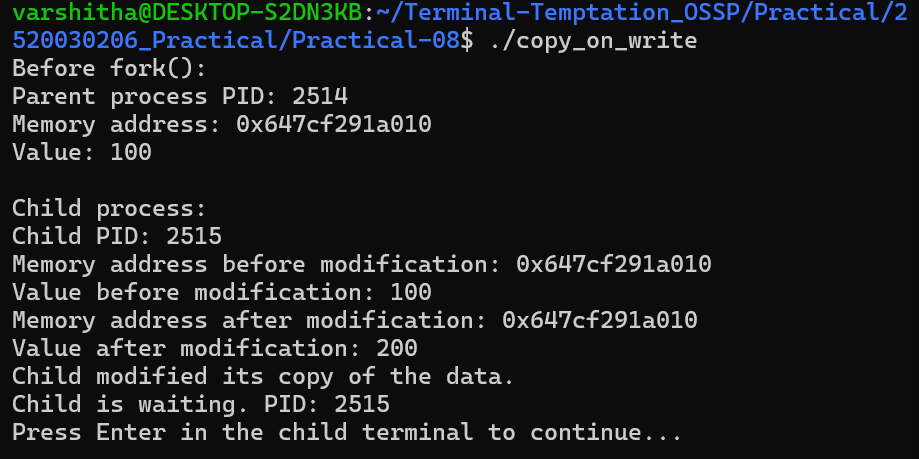

# Practical 8 - Dynamic Memory Allocation and Copy-on-Write

## Aim

1. Develop a program using `malloc()`, `calloc()`, `realloc()`, and `free()`.
2. Monitor memory allocation behavior and identify memory leaks using Valgrind.
3. Develop a program to demonstrate Copy-on-Write behavior after `fork()`.
4. Analyze memory usage before and after modifying data in the child process.

## 1. Dynamic Memory Allocation

The program demonstrates the use of `malloc()`, `calloc()`, `realloc()`, and `free()`.

### Program Output

## 2. Valgrind Memory Leak Analysis

Valgrind was used to monitor the allocated memory and identify memory leaks.

### Valgrind Output

### Result

- Heap blocks in use at exit: 0
- Memory leaks: No leaks
- Errors: 0
- Total heap usage: 5 allocs, 5 frees

## 3. Copy-on-Write Using fork()

The program demonstrates Copy-on-Write behavior after creating a child process using `fork()`.

The child changes the value from `100` to `200`, while the parent retains the value `100`.

### Program Output

## 4. Copy-on-Write Memory Observation

The child process was kept running so that its memory could be inspected using `pmap`.

### Child Process Waiting

## Tools Used

- GCC
- Linux / Ubuntu
- Valgrind
- `fork()`
- `pmap`

## Conclusion

The practical demonstrates dynamic memory allocation using `malloc()`, `calloc()`, `realloc()`, and `free()`, memory leak detection using Valgrind, and Copy-on-Write behavior after `fork()`.
