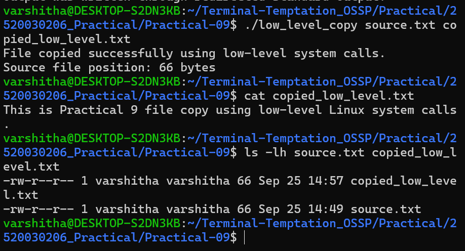
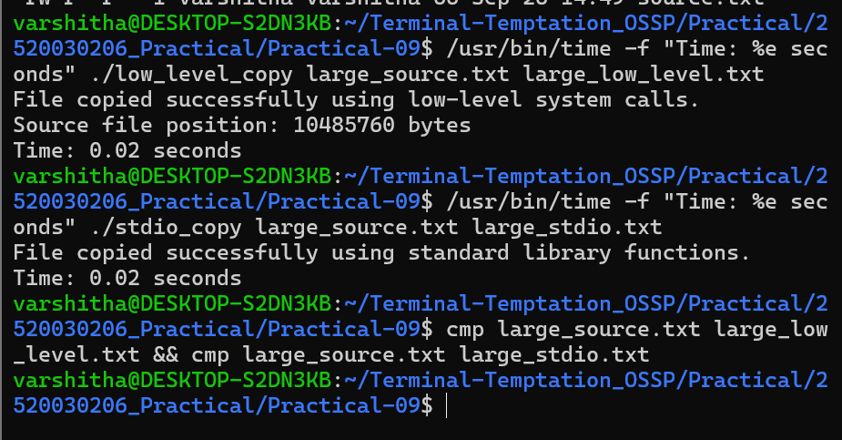
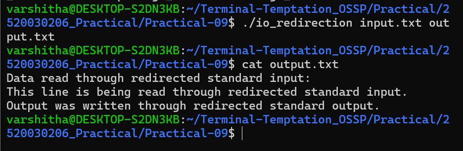

# Practical 9 - Linux File I/O and I/O Redirection

## Aim

To implement a file copy utility using low-level Linux file I/O system calls and compare it with standard library file operations. Also, to demonstrate standard input and output redirection using `dup2()`.

## Programs

### 1. Low-Level File Copy

**File:** `low_level_copy.c`

Uses:

- `open()`
- `read()`
- `write()`
- `lseek()`
- `close()`

### Output

The source file was successfully copied using low-level Linux system calls.

---

### 2. Standard Library File Copy

**File:** `stdio_copy.c`

Uses:

- `fopen()`
- `fread()`
- `fwrite()`
- `fclose()`

### Performance Comparison

A 10 MiB file was used for testing.

| Method | Time |
|---|---:|
| Low-level system calls | 0.01 seconds |
| Standard library functions | 0.01 seconds |

Both copied files were verified using `cmp`.

---

### 3. I/O Redirection Using `dup2()`

**File:** `io_redirection.c`

The program redirects:

- Standard input using `dup2()`
- Standard output using `dup2()`

The input was read from `input.txt` and the output was written to `output.txt`.

---

## Conclusion

The file copy utility was successfully implemented using both low-level Linux system calls and standard library functions. Performance was compared using a 10 MiB file. Standard input and output redirection was successfully demonstrated using `dup2()`, showing the basic mechanism used by Linux shells for I/O redirection.
