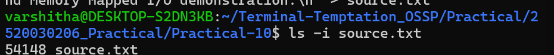
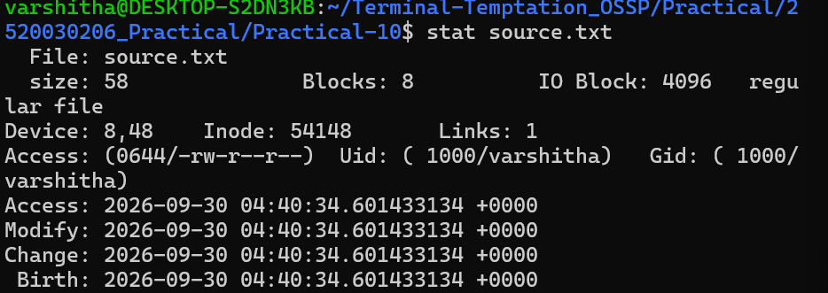
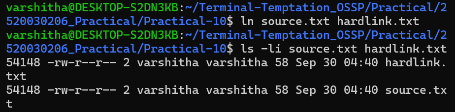
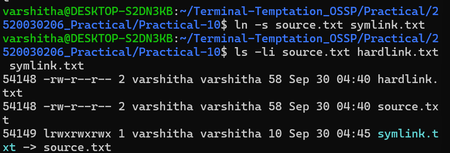
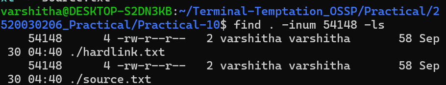
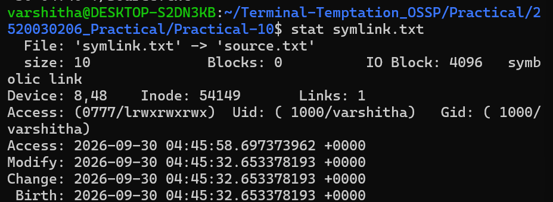
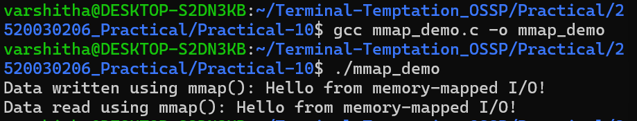
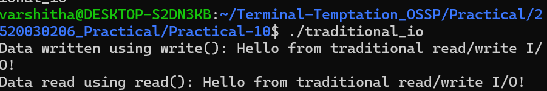

# Practical-10: Inode Structures and Memory-Mapped I/O

## Objective

The objectives of this practical are:

1. To investigate inode structures in Linux using `ls -i`, `stat`, and `find`.
2. To understand the difference between hard links and symbolic links.
3. To observe inode allocation and link counts when creating hard and symbolic links.
4. To implement file reading and writing using the `mmap()` system call.
5. To implement traditional file reading and writing using `read()` and `write()`.
6. To compare memory-mapped I/O with traditional file I/O in terms of efficiency and implementation complexity.

---

# Part A: Investigation of Inode Structures

## 1. Introduction to Inodes

In Linux, an inode is a data structure that stores metadata about a file. It contains information such as:

- File type
- File permissions
- File owner
- File group
- File size
- Number of hard links
- Timestamps
- Inode number
- Locations of the file's data blocks

The filename itself is stored in a directory entry, which associates the filename with an inode number.

---

## 2. Creating the Source File

A file named `source.txt` was created for investigating inode structures.

The file was checked using:

```bash
ls -i source.txt
```

The output was:

```text
54148 source.txt
```

This shows that the inode number of `source.txt` is **54148**.

### Screenshot 1



---

## 3. Inspecting the Inode Using stat

The `stat` command was used to display detailed metadata about the file.

Command:

```bash
stat source.txt
```

Important information obtained:

```text
Inode: 54148
Links: 1
Size: 58
```

The inode number is **54148**, and the link count is initially **1**.

### Screenshot 2



---

## 4. Creating a Hard Link

A hard link was created using:

```bash
ln source.txt hardlink.txt
```

The inode information was then checked using:

```bash
ls -li source.txt hardlink.txt
```

The output showed:

```text
54148 -rw-r--r-- 2 varshitha varshitha 58 hardlink.txt
54148 -rw-r--r-- 2 varshitha varshitha 58 source.txt
```

Both filenames have the same inode number:

```text
54148
```

The link count changed from **1 to 2**.

This means that both `source.txt` and `hardlink.txt` point to the same inode and therefore refer to the same underlying file data.

### Screenshot 3



---

## 5. Creating a Symbolic Link

A symbolic link was created using:

```bash
ln -s source.txt symlink.txt
```

The inode information was checked using:

```bash
ls -li source.txt hardlink.txt symlink.txt
```

The output showed:

```text
54148 ... hardlink.txt
54148 ... source.txt
54149 lrwxrwxrwx 1 varshitha varshitha 10 symlink.txt -> source.txt
```

The symbolic link has a different inode number:

```text
54149
```

Unlike a hard link, the symbolic link does not point directly to the same inode. It stores the path of the target file.

### Screenshot 4



---

## 6. Finding Files Using an Inode Number

The `find` command was used with the inode number:

```bash
find . -inum 54148 -ls
```

The command displayed both:

```text
./hardlink.txt
./source.txt
```

This confirms that both directory entries are associated with inode **54148**.

### Screenshot 5



---

## 7. Inspecting the Symbolic Link

The symbolic link was inspected using:

```bash
stat symlink.txt
```

The output showed:

```text
File: 'symlink.txt' -> 'source.txt'
Inode: 54149
Links: 1
symbolic link
```

This confirms that `symlink.txt` has its own inode, **54149**, and points to `source.txt`.

### Screenshot 6



---

## 8. Hard Link vs Symbolic Link

| Feature | Hard Link | Symbolic Link |
|---|---|---|
| Inode | Same as original file | Different inode |
| Data | Refers directly to same file data | Stores path to target |
| Link count | Increases link count | Does not increase target's link count |
| Cross-filesystem | Generally cannot cross filesystems | Can cross filesystems |
| Target deletion | Other hard link still accesses data | Link becomes broken if target is deleted |
| Example | `ln source.txt hardlink.txt` | `ln -s source.txt symlink.txt` |

---

## 9. Impact of Inode Allocation

The experiment demonstrated the following.

### Original file

```text
source.txt
Inode = 54148
Links = 1
```

### After creating a hard link

```text
source.txt      -> Inode 54148
hardlink.txt    -> Inode 54148
Links = 2
```

No new inode was created for `hardlink.txt`. Both filenames refer to the same inode and underlying file data.

### After creating a symbolic link

```text
source.txt      -> Inode 54148
symlink.txt     -> Inode 54149
```

A new inode was allocated for the symbolic link.

Therefore, hard links share the inode and underlying file data, while symbolic links have their own inode and store the target pathname.

---

# Part B: Memory-Mapped I/O

## 10. Introduction to mmap()

The `mmap()` system call maps a file into the process's virtual memory address space.

After mapping a file, the program can access the mapped memory directly instead of explicitly calling `read()` and `write()` for every operation.

The program developed in this practical performs both writing and reading using memory-mapped I/O.

---

## 11. mmap() Program

The source file is:

```text
mmap_demo.c
```

The program performs the following operations:

1. Creates `mmap_file.txt`.
2. Sets the file size using `ftruncate()`.
3. Maps the file into memory using `mmap()`.
4. Writes data into the mapped memory using `memcpy()`.
5. Synchronizes the modified memory using `msync()`.
6. Reads the data directly from the mapped memory.
7. Removes the mapping using `munmap()`.

The program was compiled using:

```bash
gcc mmap_demo.c -o mmap_demo
```

It was executed using:

```bash
./mmap_demo
```

Output:

```text
Data written using mmap(): Hello from memory-mapped I/O!
Data read using mmap(): Hello from memory-mapped I/O!
```

### Screenshot 7



---

# Part C: Traditional File I/O

## 12. Traditional read() and write()

Traditional file I/O uses system calls such as:

- `open()`
- `read()`
- `write()`
- `lseek()`
- `close()`

The program developed in this practical is:

```text
traditional_io.c
```

The program performs the following operations:

1. Creates `traditional_file.txt`.
2. Opens the file using `open()`.
3. Writes data using `write()`.
4. Moves the file pointer to the beginning using `lseek()`.
5. Reads data using `read()`.
6. Displays the data.
7. Closes the file using `close()`.

The program was compiled using:

```bash
gcc traditional_io.c -o traditional_io
```

It was executed using:

```bash
./traditional_io
```

Output:

```text
Data written using write(): Hello from traditional read/write I/O!
Data read using read(): Hello from traditional read/write I/O!
```

### Screenshot 8



---

# Part D: Comparison of mmap() and Traditional I/O

## 13. Efficiency Comparison

| Feature | Memory-Mapped I/O (`mmap`) | Traditional I/O (`read/write`) |
|---|---|---|
| Access method | File is mapped into virtual memory | Data is explicitly transferred using system calls |
| Reading | Access memory directly | Uses `read()` |
| Writing | Modify mapped memory | Uses `write()` |
| System calls | Mapping requires `mmap()` and related operations | Uses `read()` and `write()` for data transfer |
| Repeated access | Can be efficient for repeated or random access | May require repeated read operations |
| Large files | Can be useful when accessing portions of large files | Explicit buffer management is required |
| Memory management | Managed through virtual memory mapping | Programmer manages read/write buffers |
| Implementation | Slightly more complex | Generally straightforward |
| Performance | Can reduce explicit data-copy and system-call overhead for some workloads | Simple and predictable, but repeated calls can add overhead |
| Best suited for | Frequent or random access to mapped file regions | Simple sequential file operations |

---

## 14. Implementation Complexity

### mmap()

The `mmap()` approach requires additional concepts and operations such as:

```text
mmap()
msync()
munmap()
ftruncate()
```

Therefore, it requires more understanding of virtual memory and memory mapping.

### Traditional I/O

Traditional I/O mainly uses:

```text
open()
read()
write()
lseek()
close()
```

This approach is generally easier to understand for basic file operations because the programmer explicitly controls reading and writing.

---

## 15. Efficiency Considerations

`mmap()` can be advantageous when a program repeatedly accesses different parts of a file because the file can remain mapped into the process's address space.

Traditional `read()` and `write()` operations provide explicit control over when data is transferred and are often simple for sequential file processing.

However, `mmap()` is not automatically faster for every workload. Actual performance depends on factors such as:

- File size
- Access pattern
- Number of accesses
- Operating system
- Available memory
- Page-cache behavior
- Storage device

Therefore, the appropriate method depends on the requirements of the application.

---

# 16. Practical File Structure

The final Practical-10 directory contains:

```text
Practical-10/
│
├── README.md
├── source.txt
├── hardlink.txt
├── symlink.txt
├── mmap_demo.c
├── traditional_io.c
├── mmap_file.txt
├── traditional_file.txt
│
├── Screenshot1.png
├── Screenshot2.png
├── Screenshot3.png
├── Screenshot4.png
├── Screenshot5.png
├── Screenshot6.png
├── Screenshot7.png
└── Screenshot8.png
```

---

# 17. Conclusion

This practical provided an understanding of Linux inode structures, hard links, and symbolic links.

The inode investigation demonstrated that a hard link shares the same inode with the original file, while a symbolic link receives its own inode and stores the pathname of the target.

The practical also demonstrated two approaches to file I/O. The `mmap()` program performed reading and writing by mapping the file into memory, while the traditional program used `read()` and `write()` system calls.

Memory-mapped I/O can be useful for repeated or random access patterns, while traditional I/O provides a simple and explicit method for sequential file operations. The choice between the two depends on the application's access pattern, performance requirements, and implementation needs.
