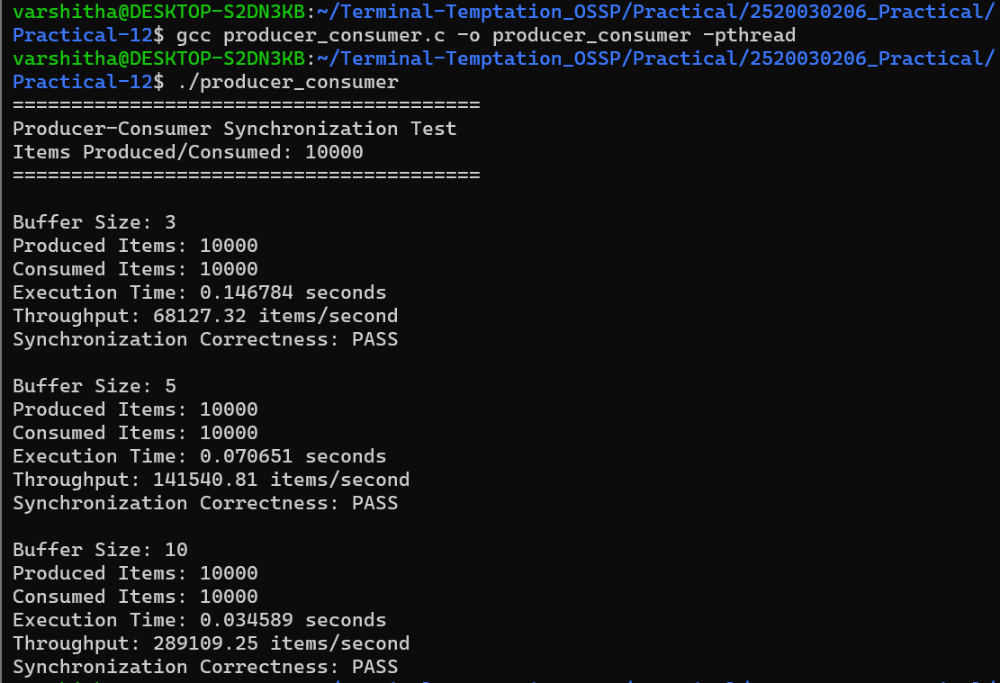
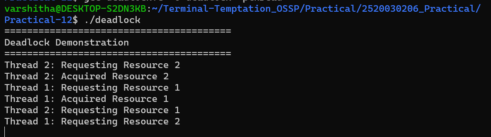
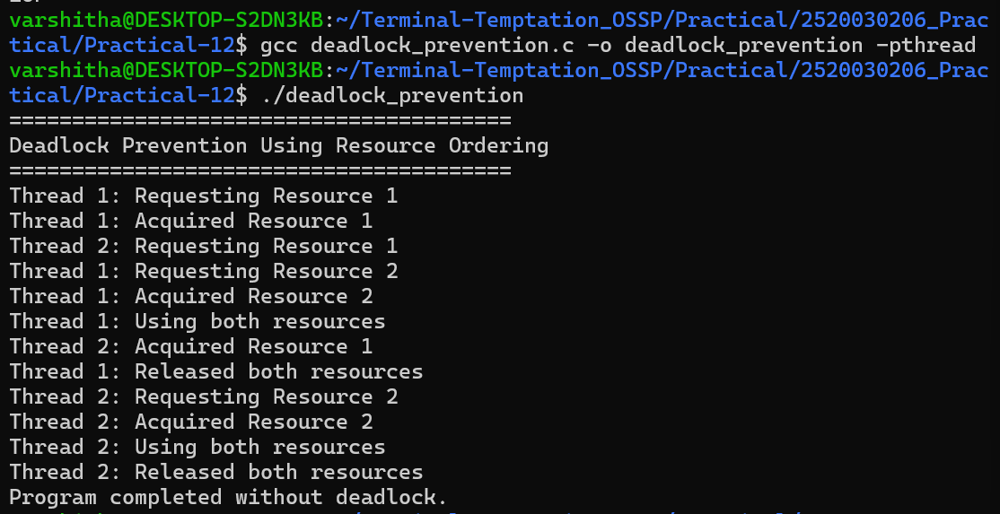

# Practical-12: Producer-Consumer Synchronization and Deadlock

## 1. Aim

To implement the Producer-Consumer problem using counting semaphores and POSIX threads, evaluate synchronization correctness and system throughput under different buffer sizes, demonstrate a deadlock scenario involving multiple threads competing for shared resources, identify the four necessary conditions for deadlock, and implement a deadlock prevention strategy using resource ordering.

---

## 2. Objectives

- Implement the Producer-Consumer problem using POSIX threads.
- Use counting semaphores for synchronization.
- Protect the shared buffer using a mutex.
- Evaluate synchronization correctness.
- Measure throughput for different buffer sizes.
- Demonstrate a deadlock scenario.
- Identify the four necessary conditions for deadlock.
- Prevent deadlock using resource ordering.

---

# Part A – Producer-Consumer Problem

## 3. Introduction

The Producer-Consumer problem is a classical operating-system synchronization problem.

A producer generates items and places them into a shared buffer, while a consumer removes items from the buffer.

Synchronization is required to ensure that:

- The producer does not insert an item when the buffer is full.
- The consumer does not remove an item when the buffer is empty.
- Only one thread accesses the shared buffer at a time.

Counting semaphores and a mutex are used to achieve correct synchronization.

---

## 4. Synchronization Mechanism

Two counting semaphores are used.

### Empty Semaphore

The `empty` semaphore represents the number of empty positions available in the buffer.

It is initialized with the buffer size.

### Full Semaphore

The `full` semaphore represents the number of items currently available in the buffer.

It is initially initialized to zero.

### Mutex

A mutex protects the critical section where the producer and consumer access the shared buffer.

---

## 5. POSIX Functions Used

| Function | Purpose |
|---|---|
| `pthread_create()` | Creates a new thread |
| `pthread_join()` | Waits for a thread to finish |
| `pthread_mutex_lock()` | Locks the critical section |
| `pthread_mutex_unlock()` | Unlocks the critical section |
| `sem_wait()` | Waits for a semaphore resource |
| `sem_post()` | Signals a semaphore resource |

---

## 6. Implementation

The program produces and consumes 10,000 items.

Three buffer sizes were tested:

- Buffer size = 3
- Buffer size = 5
- Buffer size = 10

For every buffer size, the program records:

- Produced items
- Consumed items
- Execution time
- Throughput
- Synchronization correctness

---

## 7. Compilation

```bash
gcc producer_consumer.c -o producer_consumer -pthread                                                                                                       ---                                                                                                                                                         8. Execution
```
./producer_consumer
9. Producer-Consumer Results
Buffer Size 3
Produced Items: 10000
Consumed Items: 10000
Execution Time: 0.146784 seconds
Throughput: 68127.32 items/second
Synchronization Correctness: PASS
Buffer Size 5
Produced Items: 10000
Consumed Items: 10000
Execution Time: 0.070651 seconds
Throughput: 141540.81 items/second
Synchronization Correctness: PASS
Buffer Size 10
Produced Items: 10000
Consumed Items: 10000
Execution Time: 0.034589 seconds
Throughput: 289109.25 items/second
Synchronization Correctness: PASS
Screenshot 1 – Producer-Consumer Results

10. Synchronization Correctness Analysis

For all three buffer sizes:

Produced Items = 10000
Consumed Items = 10000
Synchronization Correctness = PASS

This confirms that the producer and consumer were synchronized correctly.

The empty semaphore prevents the producer from writing into a full buffer.

The full semaphore prevents the consumer from reading from an empty buffer.

The mutex protects the shared buffer and its indexes from simultaneous access.

Therefore, no items were lost in the experiment.

11. Throughput Analysis
Buffer Size	Execution Time	Throughput
3	0.146784 seconds	68127.32 items/second
5	0.070651 seconds	141540.81 items/second
10	0.034589 seconds	289109.25 items/second

In this experiment, the observed throughput increased as the buffer size increased.

A larger buffer can reduce the frequency with which the producer or consumer has to wait because the buffer is full or empty.

The exact execution time and throughput can vary depending on system load and thread scheduling.

Part B – Deadlock
12. Introduction to Deadlock

A deadlock occurs when two or more threads wait indefinitely for resources held by one another.

In this experiment, two threads compete for two shared resources:

Resource 1
Resource 2
13. Deadlock Scenario

Thread 1 acquires Resource 1 and then requests Resource 2.

Thread 2 acquires Resource 2 and then requests Resource 1.

The situation becomes:

Thread 1:
Holds Resource 1
        ↓
Waits for Resource 2

Thread 2:
Holds Resource 2
        ↓
Waits for Resource 1

Neither thread can proceed.

This produces a deadlock.

14. Four Necessary Conditions for Deadlock
1. Mutual Exclusion

A resource can be held by only one thread at a time.

2. Hold and Wait

A thread holds one resource while waiting for another resource.

3. No Preemption

A resource cannot be forcibly taken away from a thread holding it.

4. Circular Wait

A circular chain of threads exists where each thread waits for a resource held by another thread.

In this experiment:

Thread 1 → Resource 1 → waits for Resource 2
Thread 2 → Resource 2 → waits for Resource 1

Therefore, circular wait occurs.

15. Deadlock Demonstration
Compilation
gcc deadlock.c -o deadlock -pthread
Execution
./deadlock

The program reaches a state where:

Thread 1: Acquired Resource 1
Thread 2: Acquired Resource 2
Thread 1: Requesting Resource 2
Thread 2: Requesting Resource 1

At this point, both threads wait indefinitely for each other's resource.

Screenshot 2 – Deadlock Occurrence

Part C – Deadlock Prevention
16. Resource Ordering

Deadlock can be prevented by enforcing a fixed order for acquiring resources.

In the prevention program, both threads acquire resources in the same order:

Resource 1
    ↓
Resource 2

Therefore, a circular wait cannot be formed.

17. Deadlock Prevention Implementation

Both threads follow the same resource ordering.

Thread 1
Acquire Resource 1
Acquire Resource 2
Use resources
Release Resource 2
Release Resource 1
Thread 2
Acquire Resource 1
Acquire Resource 2
Use resources
Release Resource 2
Release Resource 1

Since both threads follow the same ordering, deadlock is prevented.

18. Compilation
gcc deadlock_prevention.c -o deadlock_prevention -pthread
19. Execution
./deadlock_prevention

The program completes successfully:

Program completed without deadlock.
Screenshot 3 – Deadlock Prevention

20. Comparison
Feature	Producer-Consumer	Deadlock Demonstration	Deadlock Prevention
Main Concept	Synchronization	Deadlock	Deadlock Prevention
Threads	Producer and Consumer	Two Threads	Two Threads
Synchronization	Semaphores + Mutex	Mutexes	Mutexes
Problem	Shared Buffer Access	Circular Waiting	Circular Wait Removed
Result	Correct Synchronization	Deadlock Occurs	No Deadlock
21. Experimental Analysis

The Producer-Consumer experiment demonstrates correct synchronization using POSIX threads, counting semaphores, and mutex locks.

For all tested buffer sizes, 10,000 items were produced and 10,000 items were consumed successfully.

The observed throughput increased when the buffer size was increased from 3 to 5 and then to 10.

The deadlock experiment demonstrates how acquiring shared resources in different orders can create circular waiting.

The resource-ordering solution prevents this by requiring every thread to acquire Resource 1 before Resource 2.

22. Conclusion

The Producer-Consumer problem was successfully implemented using POSIX threads, counting semaphores, and mutex synchronization.

Synchronization correctness was verified for different buffer sizes, and throughput was measured.

A deadlock scenario involving two threads and two shared resources was successfully demonstrated.

The four necessary conditions for deadlock were identified:

Mutual exclusion
Hold and wait
No preemption
Circular wait

Finally, deadlock was prevented using resource ordering.

Thus, this practical demonstrates important operating-system concepts involving thread synchronization, semaphore usage, performance measurement, deadlock occurrence, and deadlock prevention.

23. File Structure
Practical-12/
│
├── README.md
├── producer_consumer.c
├── deadlock.c
├── deadlock_prevention.c
├── Screenshot1.png
├── Screenshot2.png
└── Screenshot3.png
24. Final Result

The practical successfully demonstrates:

POSIX thread creation and joining
Counting semaphore synchronization
Mutex-based synchronization
Producer-Consumer correctness
Throughput comparison for different buffer sizes
Deadlock occurrence
Four necessary deadlock conditions
Deadlock prevention using resource ordering


## Screenshots

### Producer-Consumer Results


### Deadlock Occurrence


### Deadlock Prevention

