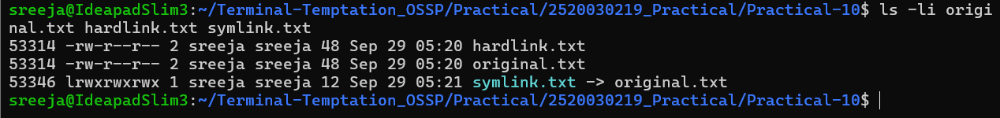
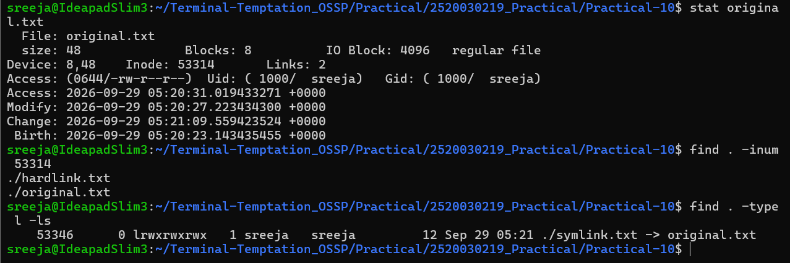
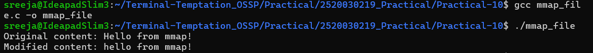

# Practical 10 – Inode Structures and Memory-Mapped I/O

## Output Screenshots

### 1. Inode, Hard Link and Symbolic Link

### 2. Inode and Find Command Output

### 3. mmap() Program Output

---

## Practical Overview

This practical investigates Linux inode structures, hard links, symbolic links, and memory-mapped file I/O using `mmap()`.

### Topics Covered

- Inode investigation using `ls -i` and `stat`
- Hard link creation using `ln`
- Symbolic link creation using `ln -s`
- Inode searching using `find`
- File reading and writing using `mmap()`
- Comparison of `mmap()` with traditional `read()/write()` operations

## Files

- `mmap_file.c` – C program implementing memory-mapped file I/O
- `original.txt` – Original file used for inode experiments
- `hardlink.txt` – Hard link to the original file
- `symlink.txt` – Symbolic link to the original file
- `mmap.txt` – File used by the `mmap()` program
- `overview.md` – Detailed explanation, commands, program, comparison, and result
- `output/` – Screenshots of practical outputs
