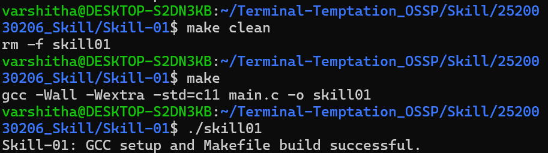
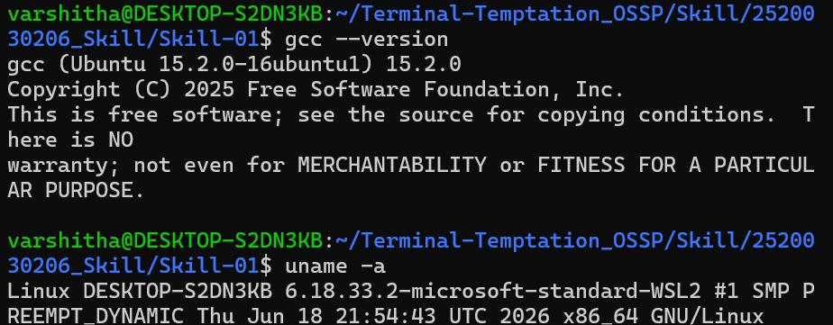
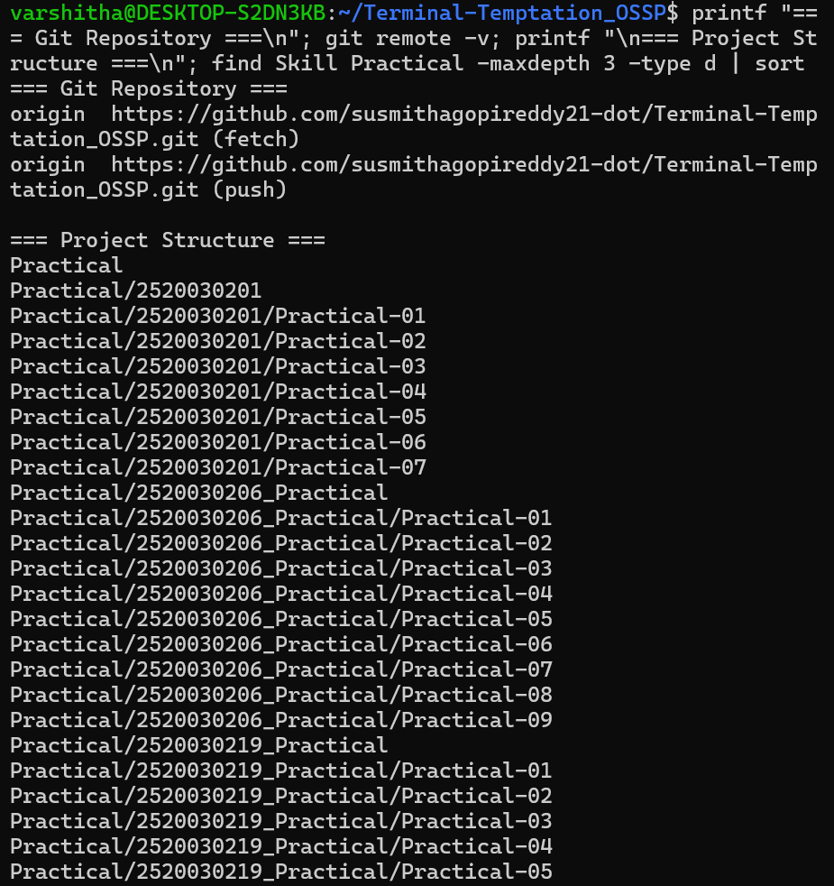
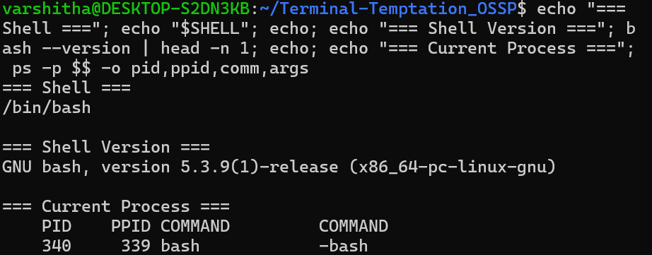

# Skill-01 – Linux Environment, GCC and Makefile Setup

## Objective

To install and configure the Linux development environment, verify GCC, set up the Git repository and project structure, understand basic shell architecture, and create an initial Makefile for building a C program.

---

## 1. Linux Environment

The project was developed using Ubuntu running through Windows Subsystem for Linux (WSL2).

The Linux system was verified using:

```bash
uname -a
```

The system reported:

```text
Linux DESKTOP-S2DN3KB 6.18.33.2-microsoft-standard-WSL2 x86_64 GNU/Linux
```

This confirms that the project is being developed in a 64-bit Linux environment using WSL2.

---

## 2. GCC Verification

GCC was verified using:

```bash
gcc --version
```

The installed GCC version was:

```text
gcc (Ubuntu 15.2.0-16ubuntu1) 15.2.0
```

GCC is used to compile C programs in the Linux environment.

---

## 3. Project Structure

The Skill project was organized inside the Git repository as follows:

```text
Terminal-Temptation_OSSP/
├── Practical/
└── Skill/
    ├── 2520030201_Skill/
    ├── 2520030206_Skill/
    │   └── Skill-01/
    │       ├── Makefile
    │       ├── main.c
    │       ├── README.md
    │       ├── Screenshot1.png
    │       ├── Screenshot2.png
    │       ├── Screenshot3.png
    │       └── Screenshot4.png
    └── 2520030219_Skill/
```

The Git remote repository was configured as:

```text
https://github.com/susmithagopireddy21-dot/Terminal-Temptation_OSSP.git
```

---

## 4. Shell Architecture

The shell environment was inspected using:

```bash
echo "$SHELL"
bash --version
ps -p $$ -o pid,ppid,comm,args
```

The shell was identified as:

```text
/bin/bash
```

The Bash version was:

```text
GNU bash, version 5.3.9(1)-release
```

The current shell process was also inspected to understand the relationship between the shell process and its parent process.

---

## 5. C Program

The file `main.c` contains a simple C program:

```c
#include <stdio.h>

int main() {
    printf("Skill-01: GCC setup and Makefile build successful.\n");
    return 0;
}
```

The program verifies that GCC can successfully compile and execute a C program.

---

## 6. Makefile

The project uses a Makefile to automate compilation.

```makefile
CC = gcc
CFLAGS = -Wall -Wextra -std=c11

TARGET = skill01
SOURCE = main.c

all: $(TARGET)

$(TARGET): $(SOURCE)
	$(CC) $(CFLAGS) $(SOURCE) -o $(TARGET)

clean:
	rm -f $(TARGET)
```

### Makefile Components

- `CC` specifies the GCC compiler.
- `CFLAGS` enables warnings and uses the C11 standard.
- `TARGET` specifies the executable name.
- `SOURCE` specifies the C source file.
- `all` builds the program.
- `clean` removes the generated executable.

---

## 7. Build and Execution

The program was built using:

```bash
make clean
make
./skill01
```

The build completed successfully and produced the output:

```text
Skill-01: GCC setup and Makefile build successful.
```

The generated executable was removed after testing so that only the source files, Makefile, README, and screenshots remain in the project directory.

---

## 8. Screenshots

### Screenshot 1 – Makefile Build and Program Execution

The screenshot below shows the successful execution of `make clean`, `make`, and `./skill01`.



---

### Screenshot 2 – GCC and Linux System Verification

The screenshot below shows the installed GCC version and Linux system information using `uname -a`.



---

### Screenshot 3 – Git Repository and Project Structure

The screenshot below shows the Git remote repository and the Practical and Skill project structure.



---

### Screenshot 4 – Shell Architecture

The screenshot below shows the Bash shell, Bash version, and current shell process information.



---

## 9. Conclusion

The Linux development environment was successfully configured and verified. GCC was installed and working correctly, the Git repository and project structure were organized, the Bash shell environment was inspected, and a C program was successfully compiled and executed using a Makefile.
