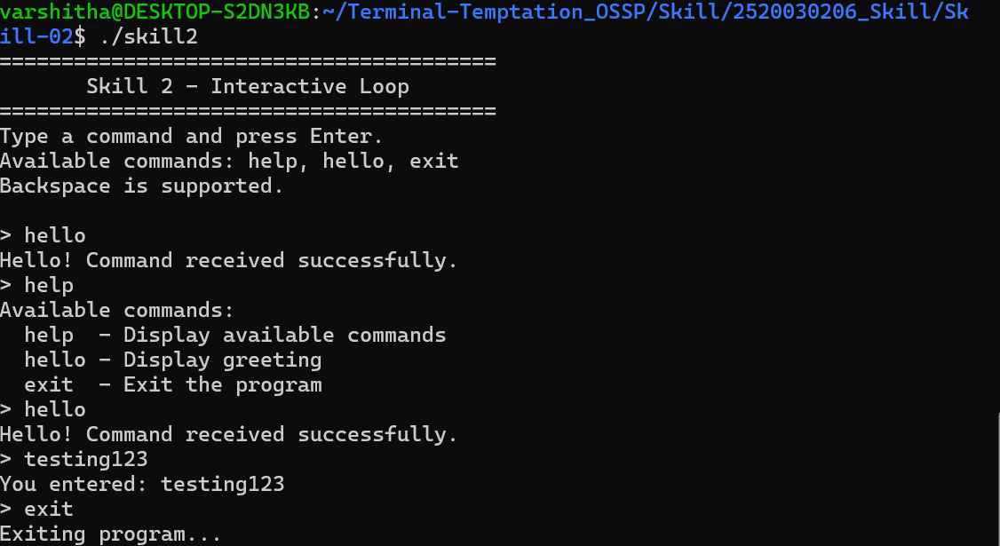
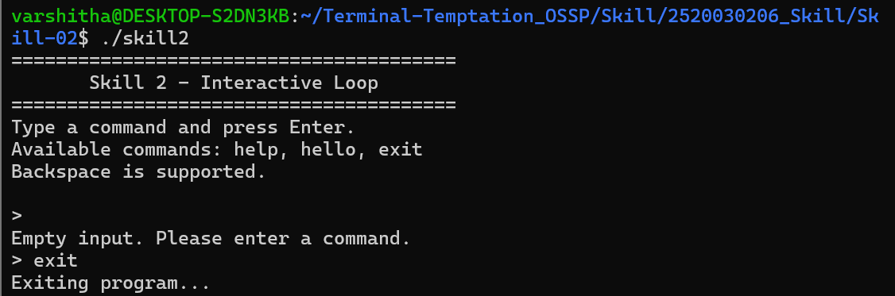

# Skill 2 – Interactive Command Loop

## Aim

To create an interactive command loop that displays a prompt, captures keyboard input, handles Backspace and Enter keys, processes multi-character commands, and exits when the user enters the `exit` command.

## Objectives

- Create a continuous main loop.
- Display a command prompt.
- Capture keyboard input character by character.
- Manage an input buffer.
- Support multi-character commands.
- Handle the Backspace key.
- Process the Enter key.
- Handle empty input.
- Recognize predefined commands.
- Handle the exit condition.
- Test interactive user interaction.

## Software Requirements

- Ubuntu Linux / WSL
- GCC compiler
- C programming language
- Linux terminal

## Hardware Requirements

- Computer or laptop
- Keyboard
- Minimum 4 GB RAM
- Any modern processor

## Concepts Used

### 1. Main Loop

The program uses a continuous `while` loop to repeatedly display the prompt, accept user input, process the command, and return to the prompt.

### 2. Raw Terminal Mode

The `termios` library is used to enable raw terminal mode. This allows the program to receive keyboard characters individually.

### 3. Keyboard Input

The `read()` system call reads one character at a time from standard input.

### 4. Input Buffer

A character array named `input` stores the characters entered by the user. The buffer can store up to 99 characters plus the terminating null character.

### 5. Backspace Handling

The program checks for ASCII Backspace values `127` and `8`. When Backspace is pressed, the last character is removed from the input buffer.

### 6. Enter Key Handling

When Enter is pressed, the input string is terminated using `'\0'` and the command is processed.

### 7. Command Processing

The program recognizes:

- `help` – displays available commands.
- `hello` – displays a greeting.
- `exit` – terminates the program.
- Any other command – displays the entered text.
- Empty input – displays an appropriate message.

### 8. Exit Condition

The main loop continues until the user enters `exit`. The program then restores the original terminal settings and terminates.

## Algorithm

1. Start the program.
2. Save the original terminal settings.
3. Enable raw terminal mode.
4. Display the program information and available commands.
5. Display the `>` prompt.
6. Initialize the input buffer.
7. Read one keyboard character.
8. If Enter is pressed, terminate the input string and process the command.
9. If Backspace is pressed, remove the previous character.
10. Otherwise, add the character to the input buffer.
11. Compare the entered command with predefined commands.
12. If the command is `exit`, display the exit message and terminate the loop.
13. If the command is `help`, display the available commands.
14. If the command is `hello`, display the greeting.
15. If another command is entered, display the entered command.
16. If the input is empty, display the empty-input message.
17. Return to the prompt and continue the loop.
18. Restore the original terminal settings.
19. End the program.

## Control Flow Diagram

The detailed control flow diagram is available in `control_flow.md`.

Overall flow:

Start → Save Terminal Settings → Enable Raw Mode → Display Prompt → Read Character → Handle Enter/Backspace/Character → Process Command → Check Exit → Display Result → Repeat → Restore Terminal → End

## Source Code

The main implementation is provided in `skill2.c`.

The program uses:

- `stdio.h` for input/output.
- `stdlib.h` for standard library functions.
- `string.h` for string comparison.
- `unistd.h` for the `read()` system call.
- `termios.h` for terminal configuration.

## Compilation

Compile the program using:

```bash
gcc skill2.c -o skill2
```

Execution

Run the program using:

./skill2
Test Cases
Test Case	Input	Expected Result	Status
1	hello	Greeting message displayed	PASS
2	help	Available commands displayed	PASS
3	hellx + Backspace + o	hello processed correctly	PASS
4	testing123	Entered command displayed	PASS
5	Empty input + Enter	Empty input message displayed	PASS
6	exit	Program terminates	PASS
Screenshots
Screenshot 1 – Interactive Command Testing

This screenshot demonstrates command processing and multi-character input.

Screenshot 2 – Empty Input and Exit Condition

This screenshot demonstrates empty input handling and the exit condition.

Result

The interactive command loop was successfully implemented and tested. The program can capture keyboard input character by character, handle Backspace and Enter keys, store multi-character commands in an input buffer, process different commands, handle empty input, and terminate using the exit command.

Conclusion

Skill 2 successfully demonstrates the implementation of an interactive terminal loop in C using Linux terminal facilities. The program demonstrates keyboard input management, buffer handling, command processing, control flow, and exit-condition handling.

## Screenshots

### Screenshot 1 – Interactive Command Testing



### Screenshot 2 – Empty Input and Exit Condition


